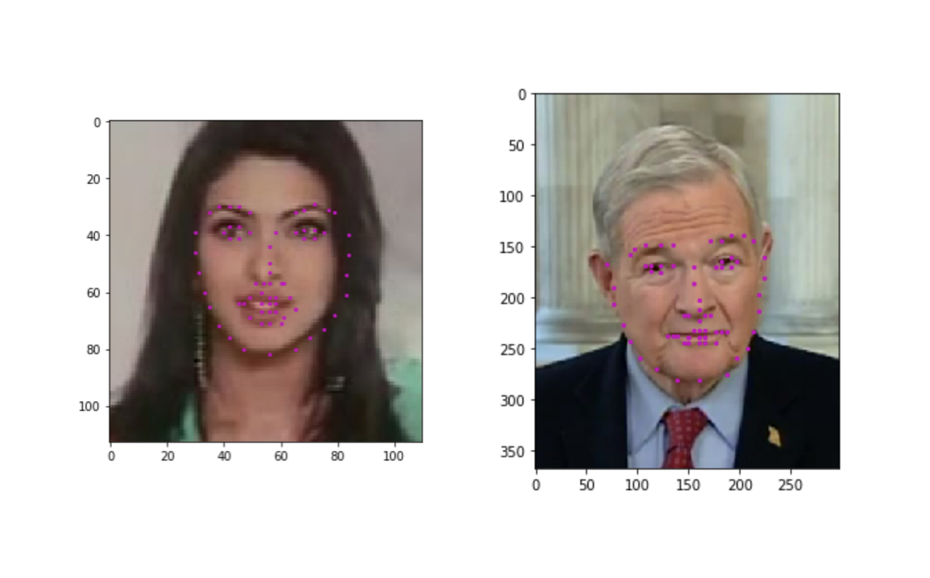

# Project : Facial Keypoint Detection

## Description

In this project, we build a facial keypoint detection system
that takes in any image with faces, and predicts the location
of 68 distinguishing keypoints on each face.

Facial keypoints include points around the eyes, nose, and mouth on a face and are used in many applications. These applications include: facial tracking, facial pose recognition, facial filters, and emotion recognition.

Some examples of these keypoints are pictured below.

## Files

- `Notebook 1`: Loading and visualizing the facial keypoint data
- `Notebook 2`: Defining and Training a Convolutional Neural Network (CNN) to predict facial keypoints
- `Notebook 3`: Facial keypoint detection using haar cascades and the trained CNN
- `Notebook 4`: Fun filters and keypoints uses
- `models.py`: Define the neural network architectures
- `data_load.py`: Data transforms classes
